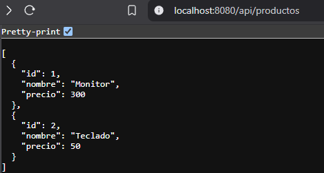

# Pruebas Automatizadas y Configuración del Entorno

Este proyecto es una API REST sencilla de Productos desarrollada en Spring Boot. El objetivo de la evaluación fue demostrar el conocimiento básico en la automatización de pruebas y la configuración de un entorno adecuado para pruebas automatizadas en una aplicación en desarrollo.

---

## Índice

- [Objetivo de la Evaluación](#objetivo-de-la-evaluación)
- [Tecnologías y Herramientas Utilizadas](#tecnologías-y-herramientas-utilizadas)
- [Estructura del Proyecto](#estructura-del-proyecto)
- [Implementación del Proyecto](#implementación-del-proyecto)
    - [API de Productos](#api-de-productos)
    - [Servicios y Modelo](#servicios-y-modelo)
- [Pruebas Automatizadas](#pruebas-automatizadas)
    - [Pruebas Unitarias](#pruebas-unitarias)
    - [Pruebas de Integración](#pruebas-de-integración)
- [Errores Encontrados y Soluciones Aplicadas](#errores-encontrados-y-soluciones-aplicadas)
- [Ejecución y Evidencias](#ejecución-y-evidencias)
- [Conclusiones](#conclusiones)
- [PARCIAL 1B](#PARCIAL_1B)
- [Objetivo de la Evaluación](#objetivo-de-la-evaluación_1B)
- [Preparacion de entorno](#preparación-del-entorno)
- [Pruebas Unitarias con Mockito](#pruebas-unitarias-con-mockito)
- [Pruebas de Integración con WebTestClient](#pruebas-de-integración-con-webtestclient)
- [Configuración del Pipeline CI/CD](#configuración-del-pipeline-cicd)
---

## Objetivo de la Evaluación

Pues mas que todo es mi capacidad para configurar un entorno de pruebas automatizadas, seleccionar y utilizar frameworks de pruebas adecuados (JUnit, Mockito, etc..), implementar pruebas unitarias e integración en una aplicación Spring Boot, y documentar el proceso y las soluciones implementadas.

---

## Tecnologías y Herramientas Utilizadas

- **Spring Boot 3.4.4**
- **Java 21 (Eclipse Temurin 21.0.6)**
- **Maven 3.9.9**
- **JUnit 5 y Mockito**
- **Git y GitHub** (para la gestión del código fuente y entrega)
- **IntelliJ IDEA** (IDE de desarrollo)

---

## Estructura del Proyecto


---

## Implementación del Proyecto

### API de Productos

Se implementaron tres endpoints:

- **GET /api/productos**: Lista todos los productos.
- **POST /api/productos**: Agrega un producto (requiere parámetros `nombre` y `precio`).
- **GET /api/productos/{id}**: Obtiene un producto por su ID.

### Servicios y Modelo

- **Modelo (`Producto.java`)**  
  Define los atributos `id`, `nombre` y `precio` y sus getters.

- **Servicio (`ProductoService.java`)**  
  Maneja la lógica en memoria para listar, agregar y obtener productos. Se usa una lista interna para simular la persistencia y un contador para asignar IDs.

---

## Pruebas Automatizadas

### Pruebas Unitarias

Se implementaron pruebas unitarias para el servicio, verificando:

- **Agregar Producto**: Se valida que el producto agregado tenga el nombre y precio correctos y se le asigne un ID.
- **Listar Productos**: Se verifica que la lista devuelta no esté vacía.
- **Obtener Producto por ID**: Se comprueba que se pueda recuperar un producto agregado mediante su ID.

*Ejemplo de prueba unitaria en `ProductoServiceTest.java`:*

```java 
@Test
void testAgregarProducto() {
    Producto producto = productoService.agregarProducto("Laptop", 1500.0);
    assertNotNull(producto.getId());
    assertEquals("Laptop", producto.getNombre());
    assertEquals(1500.0, producto.getPrecio());
    }
```
---
### Pruebas de Integración
Se implementaron pruebas de integración con MockMvc para validar el comportamiento de los endpoints REST:

- **Listar Productos**: Se simula que el servicio retorna una lista de productos y se valida el JSON devuelto.

- **Obtener Producto por ID**: Se simula la recuperación de un producto por su ID y se valida el JSON.

*Ejemplo de prueba de integración en `ProductoControllerTest.java`:*

```java
@Test
void testObtenerProductoPorId() throws Exception {
    when(productoService.obtenerProductoPorId(anyLong()))
          .thenReturn(Optional.of(new Producto(1L, "Monitor", 300.0)));

    mockMvc.perform(get("/api/productos/1"))
            .andExpect(status().isOk())
            .andExpect(jsonPath("$.nombre").value("Monitor"));
}
```

### Errores Encontrados y Soluciones Aplicadas
> *Error al cargar el ApplicationContext:*
- **Problema**: Spring Boot intentaba configurar un DataSource, pese a que no se usa base de datos.
- **Solución**: Se agregó la exclusión de DataSourceAutoConfiguration en la clase principal:

`@SpringBootApplication(exclude = {DataSourceAutoConfiguration.class})`

> *Problema de configuración en los tests:*

- **Problema**: No se encontraba la clase de configuración principal al cargar el contexto de prueba.
- **Solución**: Se usó @Import(PruebasAutomatizadasSpringApplication.class) o se definió una configuración de prueba que inyecta los mocks necesarios.

> *Errores de Tipografía y Advertencias del IDE:*

- **Problema**: Advertencias de "typo" en nombres como "Producto", "nombre", etc.
- **Solución**: Se ignoraron estas advertencias o se agregaron al diccionario del IDE, ya que no afectan la ejecución.

> *Uso de @MockBean Deprecado:*

- **Problema**: Las anotaciones @MockBean estaban marcadas como deprecadas.
- **Solución**: Se sustituyó su uso con una configuración de prueba que inyecta el mock mediante @Import y definición de un bean de prueba.

### Ejecución y Evidencias
- **Ejecución de la API**:
```
iniciar la aplicación con mvn spring-boot:run, se puede acceder a:

http://localhost:8080/api/productos para listar productos

http://localhost:8080/api/productos/{id} para obtener un producto específico.

Se pueden usar herramientas como Postman o cURL para probar el endpoint POST y agregar productos.
```
---
- **Ejecución de las Pruebas**:
```sh
Las pruebas se ejecutan correctamente con mvn test.

Se adjuntaron capturas de pantalla (en la carpeta docs/capturas/) que muestran la salida exitosa de las pruebas.

Ejemplo de comando:

mvn clean test
Salida esperada:
[INFO] Tests run: 6, Failures: 0, Errors: 0, Skipped: 0
``` 


### Conclusiones
Se logró configurar un entorno de pruebas automatizadas en un proyecto Spring Boot.
Se implementaron pruebas unitarias e integración, cumpliendo con los criterios de evaluación.
La documentación describe el proceso, errores encontrados y soluciones aplicadas.
El código fuente y las pruebas están disponibles en GitHub.




Richard Zambrano Diaz.
Repository : https://github.com/RichardZam/Automatizacion-de-Pruebas

# PARCIAL_1B

### Objetivo-de-la-evaluación_1B
Aplicar los conocimientos adquiridos en pruebas unitarias, integración y
automatización continua en un entorno controlado

### Preparación del entorno
Clona el proyecto base desde el repositorio de GitHub


### Pruebas Unitarias con Mockito

Crea un archivo ProductoServiceTest.java en el paquete test.

- Simula el comportamiento del ProductoRepository usando @Mock.
Inyecta el mock en el ProductoService con @InjectMocks.
- Escribe pruebas para:
- listarProductos()
- obtenerProductoPorId()
- crearProducto()

```
@Test
    void listarProductos() {
        // Given
        Producto producto1 = new Producto("1", "Producto 1", 100.0, 10);
        Producto producto2 = new Producto("2", "Producto 2", 200.0, 20);

        when(productoRepository.findAll()).thenReturn(Flux.just(producto1, producto2));

        // When
        Flux<Producto> resultado = productoService.findAll();

        // Then
        StepVerifier.create(resultado)
                .expectNext(producto1)
                .expectNext(producto2)
                .verifyComplete();

        verify(productoRepository, times(1)).findAll();
    }

    @Test
    void obtenerProductoPorId_Existe() {
        // Given
        String id = "1";
        Producto producto = new Producto(id, "Producto 1", 100.0, 10);

        when(productoRepository.findById(id)).thenReturn(Mono.just(producto));

        // When
        Mono<Producto> resultado = productoService.findById(id);

        // Then
        StepVerifier.create(resultado)
                .expectNext(producto)
                .verifyComplete();

        verify(productoRepository, times(1)).findById(id);
    }

    @Test
    void obtenerProductoPorId_NoExiste() {
        // Given
        String id = "999"; // ID inexistente

        when(productoRepository.findById(id)).thenReturn(Mono.empty());

        // When
        Mono<Producto> resultado = productoService.findById(id);

        // Then
        StepVerifier.create(resultado)
                .expectNextCount(0) // No devuelve ningún producto
                .verifyComplete();

        verify(productoRepository, times(1)).findById(id);
    }

    @Test
    void crearProducto() {
        // Given
        Producto producto = new Producto(null, "Nuevo Producto", 150.0, 15);
        Producto productoGuardado = new Producto("1", "Nuevo Producto", 150.0, 15);

        when(productoRepository.save(producto)).thenReturn(Mono.just(productoGuardado));

        // When
        Mono<Producto> resultado = productoService.save(producto);

        // Then
        StepVerifier.create(resultado)
                .expectNext(productoGuardado)
                .verifyComplete();

        verify(productoRepository, times(1)).save(producto);
    }

    @Test

```

### Pruebas de Integración con WebTestClient
- Crea un archivo ProductoIntegrationTest.java.


- Usa @SpringBootTest y @AutoConfigureWebTestClient.


Usa WebTestClient para simular peticiones HTTP a los siguientes endpoints:
-  POST /api/productos → crear un producto
-  GET /api/productos/{id} → obtener un producto
-  DELETE /api/productos/{id} → eliminar un producto
```
  @Test
    void testCrearProducto() {
        Producto nuevoProducto = new Producto(null, "Producto de prueba", 99.99, 5);

        webTestClient.post().uri("/api/productos")
                .body(Mono.just(nuevoProducto), Producto.class)
                .exchange()
                .expectStatus().isCreated()
                .expectBody(Producto.class)
                .value(producto -> {
                    assertThat(producto).isNotNull();
                    assertThat(producto.getId()).isNotNull();
                    assertThat(producto.getNombre()).isEqualTo("Producto de prueba");
                });
    }

    @Test
    void testObtenerProductoPorId() {
        Producto producto = new Producto(null, "Producto existente", 49.99, 10);
        Producto productoGuardado = productoRepository.save(producto).block();

        assertThat(productoGuardado).isNotNull();
        assertThat(productoGuardado.getId()).isNotNull();

        // ✅ Verifica si hay datos antes de consultar
        System.out.println("Productos en BD antes de consulta: " + productoRepository.findAll().collectList().block());

        webTestClient.get().uri("/api/productos/{id}", productoGuardado.getId())
                .exchange()
                .expectStatus().isOk()
                .expectBody(Producto.class)
                .value(p -> {
                    assertThat(p).isNotNull();
                    assertThat(p.getId()).isEqualTo(productoGuardado.getId());
                });
    }

    @Test
    void testEliminarProducto() {
        Producto producto = new Producto(null, "Producto a eliminar", 30.0, 2);
        Producto productoGuardado = productoRepository.save(producto).block();

        assertThat(productoGuardado).isNotNull();
        assertThat(productoGuardado.getId()).isNotNull();

        // Eliminar producto
        webTestClient.delete().uri("/api/productos/{id}", productoGuardado.getId())
                .exchange()
                .expectStatus().isNoContent();

        // Verificar que ya no existe
        webTestClient.get().uri("/api/productos/{id}", productoGuardado.getId())
                .exchange()
                .expectStatus().isNotFound();
    }
}

```

### Configuración del Pipeline CI/CD
- Dentro de tu proyecto, crea la carpeta:
.github/workflows/


- Dentro, crea el archivo test.yml con este contenido básico:

```
name: Pruebas Automatizadas

on:
  push:
    branches: [ master ]
  pull_request:
    branches: [ master ]

jobs:
  test:
    runs-on: ubuntu-latest
    steps:
      - name: Clonar el repositorio
        uses: actions/checkout@v3

      - name: Configurar JDK 17
        uses: actions/setup-java@v3
        with:
          java-version: '17'
          distribution: 'temurin'

      - name: Configurar Maven
        run: mvn --version

      - name: Ejecutar pruebas
        run: mvn test


      - name: Publicar Reportes de Pruebas
        if: always()
        uses: actions/upload-artifact@v3
        with:
          name: reportes-pruebas
          path: target/surefire-reports/

      - name: Notificar en caso de error
        if: failure()
        run: cat target/surefire-reports/*.txt || echo "No se encontraron logs de pruebas."

```
